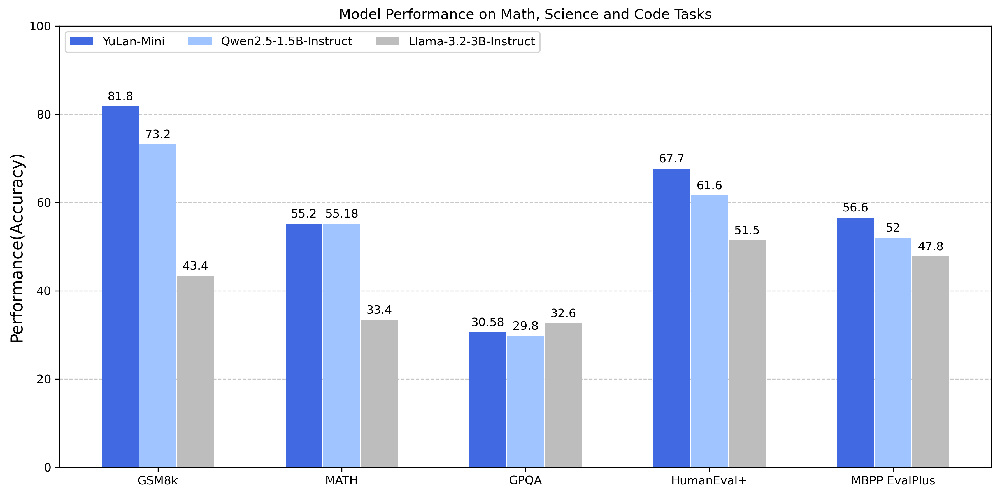

## 1. Introduction

We present **YuLan-Mini**, a compact yet powerful model with 2.4 billion parameters. Through efficient training on open or synthetic data, the model achieves comparable results without sacrificing its core capabilities.
**YuLan-Mini** is pre-trained on 1.08 trillion tokens and further enhanced through a post-training pipeline incorporating Supervised Fine-Tuning, Preference Finetuning, and Reinforcement Learning to maximize its capabilities.
Extensive evaluations demonstrate that **YuLan-Mini** achieves state-of-the-art performance, demonstrating competitive performance with leading industrial counterparts across various domains including instruction-following, math, code, and reasoning tasks.

## 2. Model Overview

**YuLan-Mini** demonstrates competitive performance compared to similarly sized models, particularly in reasoning tasks involving math and code.
We evaluate **YuLan-Mini** against other models in the frontier model series with comparable parameter sizes, including Qwen2.5-1.5B-Instruct and Llama3.2-3B-Instruct.

## 3. Supervised Finetuning

### Data
#### Data Source
We meticulously select two main data sources: 1) Open-source data and 2) Synthetic Data, enabling our model to achieve broad knowledge coverage and strong professional capabilities.

##### Open-source data
We have curated a collection of high-quality open-source datasets spanning multiple fields and subjects. These datasets are either constructed by powerful proprietary models like GPT-4 or crafted by human experts, providing a robust foundation for SFT.

##### Synthetic data
Due to the scarcity of high-quality domain-specific data, synthetic data often plays a crucial role in improving the model's professional capabilities. Consequently, we have also synthesized a large amount of targeted data in domains such as mathematics, science, and Chinese commonsense reasoning.

* **Mathematics**. Distilling from powerful models is an efficient way to construct data, especially for mathematics. However, in addition to choosing the appropriate teacher model, it is equally important to select high-quality and targeted initial instructions. Therefore, we select Qwen2.5-Math-7B-Instruct, which has strong mathematical capabilities, as the teacher model. Additionally, we choose questions of varying difficulty levels from OpenMathInstruct2, a dataset comprising over 10 million high-quality math question-answer pairs, to serve as the initial samples for distillation. Each distilled response is matched to the ground truth to ensure the precision of the answer.

* **Science**. To construct high-quality scientific datasets, we initially collect scientific texts from sources like Wiki, Reddit, and Arxiv, spanning fields such as physics, chemistry, biology, and psychology. Subsequently, we employ Qwen2.5-32B-Instruct to extract questions from these texts and generate appropriate answers. The generated question-answer pairs are then reclassified using a topic classifier to ensure that they fall within corresponding scientific categories.

* **Chinese commonsense reasoning**. For Chinese commonsense reasoning data construction, we collect data from Baidu Baike and real user interactions from platforms like WildChat and SmolTalk-Chinese. Using TF-IDF and keyword matching, we identify and filter highly relevant content, generating multiple question-answer pairs for knowledge-dense documents. For quality control, we employ the CMMLU classifier for topic categorization and LLM-based evaluation to assess response quality. To prevent hallucination, we cross-reference entity-based queries with encyclopedia entries and maintain a mapping list for consistent answers to similar questions.

#### Data Filtering
During the SFT phase, high-quality data is essential to improve model performance. Therefore, we have designed a comprehensive data filtering pipeline, which ensures that the refined dataset maximally contributes to the model's effectiveness and reliability.

##### De-duplication
In the process of data filtering, de-duplication is a standard procedure since an abundance of duplicate data can restrict the model's capacity to learn diverse knowledge, thereby rendering the training process more inefficient. To address this issue, we have chosen MinHash and Locality Sensitive Hashing (LSH) algorithms to effectively remove repeated data.

##### Heuristic filtering
Undesirable patterns in training data, such as repeated punctuation or excessive garbled text, can significantly degrade model performance. To avoid this, we have developed a series of rule-based filtering strategies to remove samples that could potentially harm the model. 

##### Quality-based scoring
LLM-as-a-Judge is an effective method for evaluating data quality. Specifically, we use Qwen2.5-32B-Instruct as the Judge to score each piece of data on three dimensions: Instruction Following, Informativeness and Truthfulness, with scores ranging from 1 to 5. We then sort the data according to the average score across these three dimensions and discard samples from the lower percentile. 

##### Complexity-based selection
Low-quality data can harm model performance, while for smaller language models, overly complex data can cause similar problems. Consequently, we focus on eliminating data that are too challenging for the model to learn from. The complexity of each instruction is measured using the following equation:

$$
\text{Comp}(x,y) = \lambda_1 \cdot L_{\text{length}}  + \lambda_2 \cdot \text{Loss}_{\text{it}}(x, y).
$$

Here, $\lambda_1$, $\lambda_2$ are the hyperparameters; $L_{\text{length}}$ denotes the length of the instruction; $\text{Loss}_{\text{it}}(x, y)$ is the loss calculated by the base model:

$$\text{Loss}_{\text{it}}(x, y)=\sum_{i=1}^{|y|} \log P(y_i | x, y_{1:i-1}),$$

where $y_i$ represents the $i$-th token in the output $y$, and $y_{1:i-1}$ denotes the sequence up to the $i-1$ tokens. 
We also sort the data by complexity and discard a certain proportion, which is overly difficult.

#### Data Mix
Merely combining different types of data in the SFT phase can cause data conflicts, which may degrade the model performance in specific domains. To mitigate the issue, we allocate data proportions based on each source's characteristics, balancing general and domain-specific data. Moreover, through extensive incremental experiments, we also dynamically adjust the data ratio in real-time according to training performance and feedback to achieve optimal results. The detailed data proportions are listed in the following table.

| **Category**  | **Count** | **Ratio** |
|---------------|-----------|-----------|
| General English    | 3.2M      | 39%      |
| General Chinese     | 3M      | 36%      |
| Math     | 1.8M      | 22%      |
| Code     | 0.2M      | 3%      |
| Total     | 8.2M      | 100% |

### Recipe
#### Training Settings
To train our model, we used 4 nodes equipped with 8xH800 GPUs with high-speed interconnect. We used an effective batch size of 512 and a maximum sequence length of 28K tokens. We trained for 2 epochs using a learning rate of 1e-5.

## 4. Preference Finetuning

### Preference Data

Our preference data consists of both off-policy and on-policy data.  
1) **Off-policy data**: We collected a collection of high-quality publicly available datasets.  
2) **On-policy data**: We curated data spanning scientific problems, mathematics, programming, Chinese common knowledge, hallucinations, and self-awareness.

Following the collection of instructional data, we sampled completions from the SFT model. For instructions with objectively verifiable answers, we extracted responses using an LLM, where correct responses were designated as chosen responses, while incorrect responses were classified as rejected responses. For other instructions, we employed the reward model *Skywork/Skywork-Reward-Llama-3.1-8B-v0.2* to assign scores. Responses receiving high scores were designated as chosen responses, whereas those with low scores were categorized as rejected responses.

The final composition of our dataset is as follows:

| Category  | Count | Ratio |
|---------------|-----------|-----------|
| Off-policy    | 258K      | 69\%      |
| On-policy     | 115K      | 31\%      |
| Total     | 373K      | 100\% |

### Preference Tuning Recipe

Based on the SFT model, we employed Direct Preference Optimization (DPO) to align the model with human preferences. The model was trained for 2 epochs with a batch size of 128, a learning rate of 5e-7, and $\beta$ set to 0.1. This configuration demonstrated good convergence during training while maintaining a balance between training efficiency and computational resource consumption.

## 5. Reinforcement Learning

Building upon the DPO model, we further enhance our model's performance and alignment with human preferences using Proximal Policy Optimization (PPO).

### Prompt Data

For PPO training, we selected 10,000 challenging prompts from the DPO dataset. These prompts, covering a variety of task types, effectively drive the model's performance across different scenarios.

### Reward Model

Given the small size of our model's parameters and the complexity of training a high-quality reward model, we chose to use an open-source reward model to provide reward scores for our training process, instead of training one ourselves. Specifically, we used the Skywork-Reward-Llama-3.1-8B-v0.2 model, which has demonstrated robust performance in reward modeling.

### Training Recipe

We used 8xH800 GPUs for training, conducting four episodes. Training was carried out using the OpenRLHF framework, which provides a flexible environment for reinforcement learning tasks. Although we encountered issues like reward hacking, which led to unstable training and output length collapse, we implemented several strategies to stabilize the training process.

- **Critic Model Initialization and Freezing the Actor's Parameters.** The critic model was initialized from the reward model. Additionally, we froze the actor's parameter updates for the first 15 training steps to allow the critic to accurately assess value estimates.
- **Adaptive KL Controller.** We adopted an Adaptive KL Controller that dynamically adjusts the KL coefficient (beta) based on the KL divergence target, balancing exploration and exploitation during training.
- **Rule-based Penalties for Reward Hacking.** We applied rule-based penalties to address reward hacking patterns, such as incomplete sentences (which also help penalize truncated responses, often containing redundant patterns in our smaller model), mixed-language responses (e.g., English prompts with Chinese characters), and single-sentence responses like "I hope this helps," which can score highly for most queries. These are just some of the patterns we've observed.

The specific hyperparameters used in our PPO training are detailed in the table below.

| **Hyperparameters**                     | **Value**              |
|-----------------------------------------|------------------------|
| Actor Learning Rate                     | $1 \times 10^{-6}$     |
| Critic Learning Rate                    | $1 \times 10^{-5}$     |
| Training Batch Size                     | 128                    |
| Freezing Actor Steps                    | 15                     |
| Number of Episodes                      | 4                      |
| Samples per Prompt                      | 4                      |
| Prompt Maximum Length                   | 2048                   |
| Generate Maximum Length                 | 2048                   |
| Initial KL Coefficient                  | 0.01                   |
| KL Target                                | 0.06                   |
| General Advantage Estimation λ          | 0.95                   |
| Discount Factor γ                       | 1.0                    |
| Generation Temperature                  | 1.0                    |
| Reward Clip Range                       | (-20, 10)              |
| Learning Rate Warmup Ratio              | 0                      |
| Learning Rate Scheduler                 | constant               |

## 6. Evaluation

We are releasing the evaluation data generated from our YuLan-Mini post-trained models tested on various benchmark tasks. This is in line with our approach during pre-training.

To show the performance of YuLan-Mini, We conduct a comparative analysis of YuLan-Mini alongside other models of comparable size and capability. To the extent possible, we evaluate the performance of other models ourselves and compare the results with the reported numbers, selecting the best score. 

We utilize the metrics outlined in following table, where higher scores are consistently preferred. 

| **Core Skill** | **Development**                |
| -------------- | ------------------------------ |
| **Knowledge**  | MMLU (0 shot, CoT)  |
|                | MMLU (5 shot)       |
|                | TruthfulQA(0 shot)  |
| **Reasoning**  | ARC(0 shot)         |
| **Math**       | MATH(0 shot, CoT)   |
|                | GSM8K(8 shot)       |
|                | GSM8K(0 shot, CoT)  |
| **Code**       | HumanEval(pass@10)  |
|                | HumanEval+(pass@10) |
|                | MBPP(pass@10)       |
|                | MBPP+(pass@10)      |

### General Knowledge

MMLU and TruthfulQA as benchmark to assess YuLan-Mini's performance in knowledge-based question answering. For MMLU, we report the macro average of subtask accuracy under the 5-shot standard setting without CoT and 0-shot standard setting with CoT. For TruthfulQA, we report the macro average of subtask accuracy under the 0-shot standard setting without CoT. As shown in  table, Our YuLan-Mini is not much different from Qwen2.5 and Llama3.2 in common sense tasks.

### Reasoning

We assess the ability of the models' reasoning ability on ARC. We report that YuLan-Mini outperform Qwen2.5 arcoss ARC, with a level in the middle of three models.

### Math

We utilize MATH and GSM8K as benchmarks to assess YuLan-Mini's performance in MATH. For MATH,we report the macro average of subtask accuracy under the 0-shot standard setting with CoT. For GSM8K, we report the macro average of subtask accuracy under the 0-shot standard setting without CoT and the macro average of subtask accuracy under the 8-shot standard setting. As shown in table, Our YuLan-Mini has a excellent math ability with higher benchmarks above Llama3.2, which is much smaller than Llama3.2.

### Code

We conduct rigorous evaluation of the models' code generation capabilities across four benchmarks: HumanEval, HumanEvalPlus, MBPP and MBPPPlus. It can be seen that our YuLan-Mini model has the highest performance according to the benchmarks, indicating that YuLan-Mini's coding ability is the best among the three.

| **Benchmarks**                 | **YuLan-Mini-Instruct** | **Llama3.2-3B-Instruct** | **Qwen-2.5-1.5B-Instruct** |
| ------------------------------ | ----------------------- | ------------------------ | -------------------------- |
| MMLU (0 shot, CoT)  | 53.56                   | **60**                   | 57.4                       |
| MMLU (5 shot)       | 52.71                   | 63.4                     | **66.5**                   |
| TruthfulQA(0 shot)  | 50.08                   | 49.7                     | **58.8**                   |
| ARC(0 shot)         | 51.79                   | **78.6**                 | 47.8                       |
| MATH(0 shot, CoT)   | 55.18                   | 48                       | **55.2**                   |
| GSM8K(8 shot)       | **81.8**                | 43.4                     | 73.2                       |
| GSM8K(0 shot, CoT)  | **71.72**               | 66                       | 69.4                       |
| HumanEval(pass@10)  | **86.6**                | 78.7                     | 84.1                       |
| HumanEval+(pass@10) | **80.5**                | 72                       | 78.0                       |
| MBPP(pass@10)       | 85.7                    | 80.4                     | **88.1**                   |
| MBPP+(pass@10)      | 75.4                    | 71.2                     | 77.5                       |

## 7. Conclusion

Our experiments demonstrate the promising performance of smaller LLMs in specific tasks. We believe that techniques like Chain-of-Thought prompting can be further optimized to enhance the reasoning capabilities of these models. Future work will focus on unlocking the full potential of our model by exploring novel methods to improve its reasoning abilities, ultimately leading to more robust and versatile performance.
